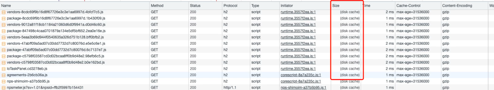
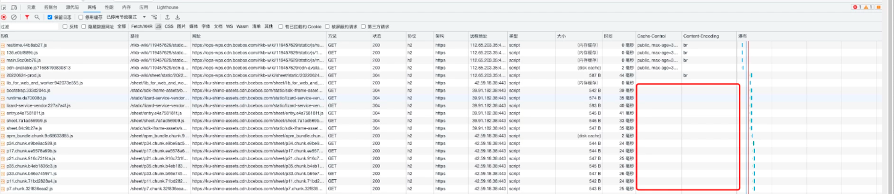

## 1 背景
私有化石墨文档的静态资源 JS、CSS，会根据客户环境的架构方案，提供不同的加速方案，以提升用户访问体验。

## 2 加速方案
* 使用客户提供的CDN加速 （充分利用CDN边缘节点加速性能好，配置简便维护成本低）
* 本地Nginx缓存加速（对本地NG资源占用高，需手动清理缓存，配置复杂维护成本高）
建议使用客户提供的CDN加速

### 2.1 使用客户提供的CDN加速
私有部署静态资源加速的配置主要有两类方案
* 支持CDN直接回源到石墨的应用服务提供的JS、CSS
* 提供对象存储并绑定CDN，石墨提供静态资源数据包上传到客户提供的对象存储

#### 2.1.1 CDN缓存配置
* CDN开启服务端缓存

* CDN开启客户端缓存

* 开启Gzip压缩

* 开启HTTP2

* 开启HTTP3


### 2.2 本地Nginx缓存加速 
提供一个NGINX，挂载前端资源和配置缓存策略。核心配置如下，开辟了共享内存，所以共享内存名js_cache别一样，否则会数据异常
注意这个开启后，nginx硬盘会变大，未来可能需要清理nginx硬盘
```nginx
upstream shimo-js {
    server  前端静态资源地址oss；
}
```

// data/nginx_cache 可以使用内存挂载，也可以默认磁盘路径，内存更快一些
// 建议内存挂载，避免硬盘IO操作
// mount --bind /dev/shm/cache  /tmp/nginx/cache
```nginx
proxy_cache_path  /data/nginx_cache levels=1:2 keys_zone=jscache:1.5g max_size=2g inactive=90d use_temp_path=on;
proxy_cache_key    $host$request_uri;

server {
    listen 443 ssl http2;
    # listen 80
    server_name  自定义域名;
    sendfile on;
    client_max_body_size 5G;
    access_log /usr/local/nginx/logs/shimo-static.log;
    gzip on;
    add_header 'Access-Control-Allow-Origin' *;
    add_header  Cache-Control max-age=31536000;
    location ~* ^.+.(css|js) {
    proxy_cache          jscache;
    proxy_cache_valid      200 304 10m;
    add_header X-Cache-Status $upstream_cache_status;
    proxy_set_header Origin 'https://业务域名';
    proxy_pass http://shimo-js;
}
```

## 3 本地缓存验证
打开Chrome控制台，查看Network -> JS 请求状态，其中 Cache-Control 列为资源缓存有效期，Content-Encoding=gzip 表示gzip压缩开启，如下图所示

当再次请求时，资源从本地磁盘加载，速度明显提升，如下图所示

下图为未开启缓存和gzip的第二次访问
