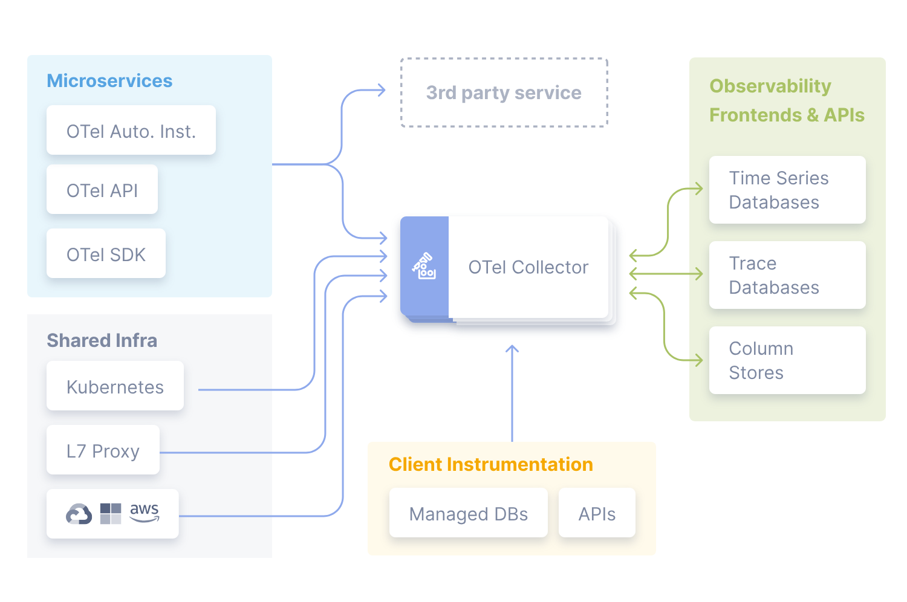

## 背景

私有化云 Office 支持接入方对接 Open Telemetry 开源工具，主要用于采集链路数据、分析耗时指标等。

如有需要，请参考对接流程进行操作。

## 对接流程

1. 接入方将 Open Telemetry Collector（简称 OTel Collector）部署到服务器，详细操作请参考 [Open Telemetry 官网](https://opentelemetry.io/docs/)。

   

2. 在接入方 Admin Panel（https://接入方域名/admin-panel/） 中修改前端配置项           “_RUNTIME_ENV__.OTLP_URL” 参数，指向 OTel Collector。

3. 根据 Open Telemetry 开源方案将 OTel Collector 数据存储到 Kafka 或者 Jaeger 中，用来查询和观测数据。

