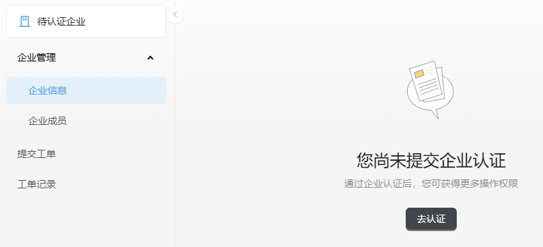
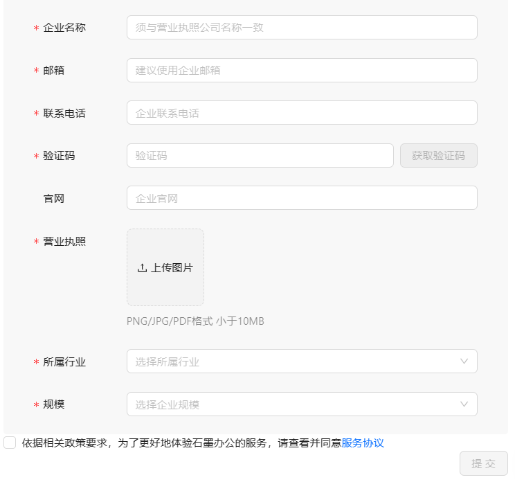
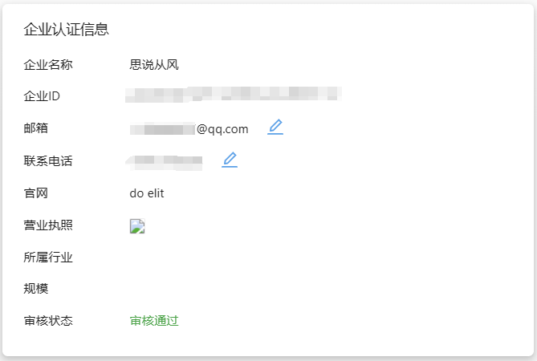
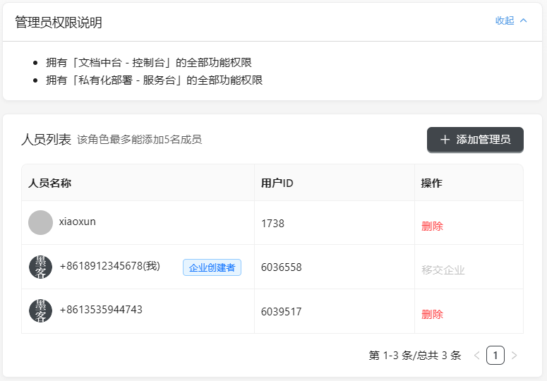

企业管理功能包括企业信息查询和企业成员管理，提供了企业认证入口、企业信息查看/修改、添加企业管理员的能力。

## 企业信息

未进行企业认证的用户，对服务台的使用权限将受限，请及时提交企业认证。
:::info 提示

请填写正确的联系电话和邮箱，以便后续石墨向您发送相关通知。

:::

企业认证通过的用户，可查看认证信息并修改联系方式。

## 企业成员

只有通过企业认证的企业，才能查看和管理企业成员。当前系统角色仅支持管理员，其他系统角色在开发中，敬请期待~

:::caution 说明

管理员权限：

- 拥有【文档中台 - 控制台】的全部功能权限
- 拥有【私有化部署 - 服务台】的全部功能权限

:::

### 人员列表

企业人员可分为企业创建者和企业普通管理员。企业创建者是为企业提交认证的用户，默认占用一个管理员额度，一个企业最多可添加5名管理员。

**企业成员的操作权限：**

| 当前登录账号   | 移交企业                 | 退出企业 | 删除管理员 |
| :------------- | :----------------------- | :------- | ---------- |
| 企业创建者     | 支持（开发中，敬请期待） | 不支持   | 支持       |
| 企业普通管理员 | 不支持                   | 支持     | 支持       |

**操作权限说明：**

- 移交企业：仅企业创建者支持移交企业（开发中，敬请期待）。
- 退出企业：执行操作后，当前登录账号失去管理员权限且退出该企业。对于单用户多企业场景，刷新页面会重新定位一个新的企业。定位优先级：已创建的且已通过认证的企业  > 剩下的加入企业中最早创建的那个 > 待认证企业
- 删除：仅删除非企业创建者，被删除的账号将失去管理员权限且退出该企业。

### 添加管理员

在企业成员页面，单击【添加管理员】，可通过石墨文档用户名和用户ID搜索并添加管理员。

## 切换企业

对于单用户归属多企业的场景，支持企业查看和切换功能。

**我创建的企业**

- 如果我创建的企业已经通过企业认证。切换到对应企业后，服务台则刷新为该企业的数据。
- 如果我创建的企业尚未通过企业认证，则表示企业并不存在，显示企业当前的状态，认证中或待认证。

**我加入的企业**

- 切换到其中一个企业后，控制台则刷新为该企业的数据。

