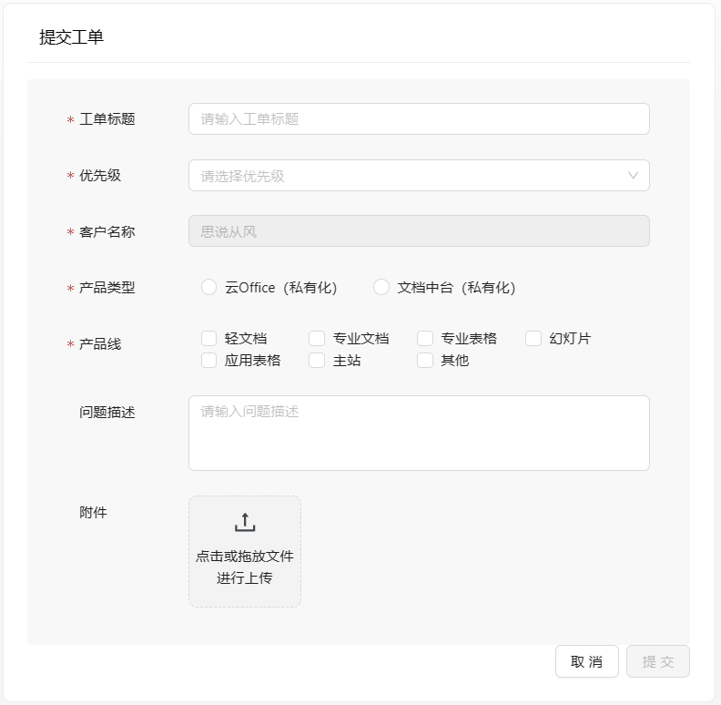
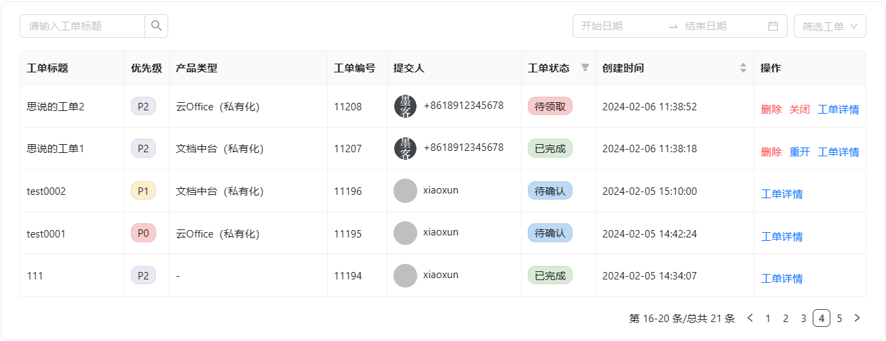

技术工单主要用于记录、处理和跟踪一项工作的完成情况。客户可以将使用石墨文档过程中遇到的问题通过工单提出，石墨售后和产研团队接入处理、反馈进度、闭环问题，提升服务质量，减少资源浪费。

## 工单流程图

## 工单操作指导

**前置条件**

- 已购买并部署私有化产品
- 已购买技术工单服务
- 登录石墨开放服务平台，完成 [企业认证](./../userguide/enterprise-management.md)

**操作步骤**

**步骤1：**单击页面右上角【私有化部署】下拉框，选择【服务台】。
:::info 提示

如果已完成企业认证，则进入下一个环节。如果未进行企业认证，则需要先完成 [企业认证](./../userguide/enterprise-management.md)。

:::

**步骤2：**在私有化部署服务台导航栏，单击【提交工单】，根据页面信息完成工单填写。

- 工单标题：简单描述遇到的问题。
- 优先级：在下拉框中选择优先级，优先级由高到低排列是 P0 > P1 > P2 > P3。
  - 紧急情况（P0）：阻碍用户使用石墨产品功能、严重影响用户体验、发生用户数据丢失、用户数据错乱、用户数据无法显示、高危安全问题。
  - 高级影响（P1）：用户可以使用产品功能，但结果与预期有明显不符、与交互设计有可明显感知的差别、严重的性能问题和安全问题。
  - 中级影响（P2）：功能可使用但与预期结果有部分不符、功能在可正确实现预期功能之外的其他问题、一般安全问题。
  - 低级影响（P3）：对用户使用产品仅有轻微影响。
- 产品类型：选择已购买的私有化产品。
- 产品线：选择想咨询的产品套件。
- 问题描述：建议详细描述问题，包括但不限于产品版本、操作内容、导致的结果，能否复现等，还可以添加图片或录屏，方便石墨产研团队定位。

**步骤3：**单击【提交】按钮，完成工单填写。

**步骤4：**在私有化部署服务台导航栏，单击【工单记录】，可以查询已提交的工单列表和信息，还可以通过工单标题、日期等筛选工单。

- 工单留言：在工单详情页，**工单创建者**可补充问题相关信息（例如使用场景、操作日志、问题详情等）和添加附件（每次允许上传3个小于25M的附件），便于快速定位并解决问题。
- 删除工单：执行此操作后，工单数据完全被删除，无法在工单列表中查询对应数据，请谨慎操作。
- 关闭工单：执行此操作后，石墨产研团队则不再跟进处理，对应的工单信息仍然可以在工单列表中查询。
- 重开工单：对于已完成的工单，如果发现问题并未解决时，**工单创建者**可重开工单继续咨询。
