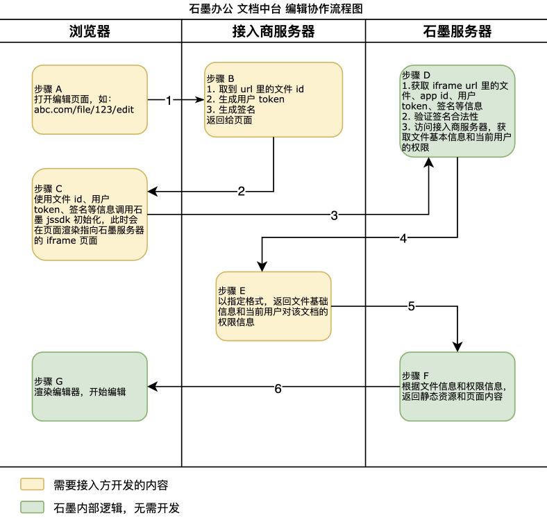
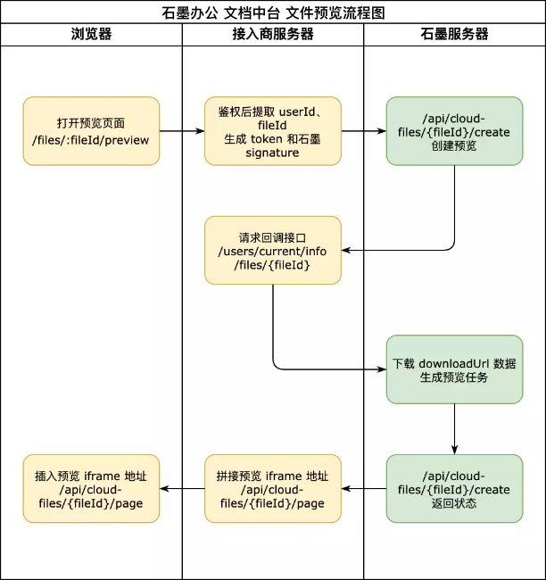

## 基本概念

石墨文档中台支持以网页的形式接入文件预览和协同编辑在线服务。

### 协同编辑

协同文档指可多人实时协作的石墨办公六大套件：文档、传统文档、表格、应用表格、表单和幻灯片。

支持直接创建石墨套件的文档来进行查看/编辑，也支持将本地文件通过 API 接口转换成协同文档来查看、编辑，详细操作请参考 [获取文件元信息-协同文档](./../04service-callback/file-information.md#file-meta-collab)。

文件将存储在石墨服务器上，存储格式为石墨特有格式（不是Office文件）。如果需要将在线文档转化成 Office文件，请参考 [导出文件](./../06API-document/interface-description/file-operation.md#export-v1)。

### 文件预览

文件预览是将接入方的文件转换成 Web 支持的格式来进行预览和查看。

要实现协同文档的预览，只需将用户对文档的权限设置为只读即可，详情操作请参考  [获取文件元信息-文件预览](./../04service-callback/file-information.md#file-meta-preview)。

此种模式下不能编辑，如果有编辑需要，请参考 [协同编辑](#协同编辑)。

## 基本流程

### 协同编辑

### 文件预览

