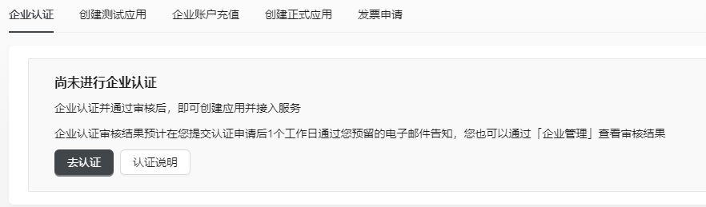
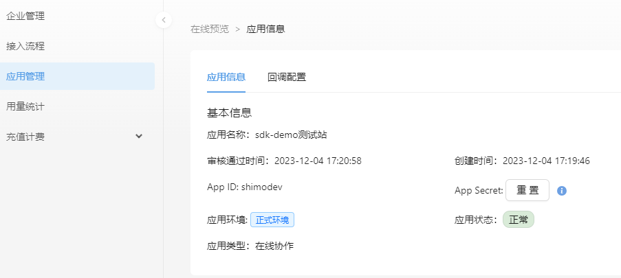

## 登录石墨账号

如果您已经注册了石墨账号，可直接登录；如果未注册过石墨账号，请注册后登录。

## 企业认证

进入 【控制台 - 企业管理】页面，提交企业认证。

请如实提交企业认证信息及营业执照图片，我们会在您提交企业认证信息后 1 个工作日内通过您预留的电子邮件告知审核结果，您也可以通过【企业管理】页面查看认证结果。

## 创建应用

支持创建测试应用和正式应用。您可以先通过创建测试应用体验产品、调试功能，如符合您的业务需求，便可以着手创建正式应用。

创建应用时需选择应用类型，应用类型决定了该应用使用的服务范围。当前暂只提供【在线协作】类型的应用，更多类型敬请期待。

:::caution 说明

您需要先对企业账号进行充值，账户余额大于 999 元才能创建正式应用。请确保企业账户余额充足，一旦发生欠费可能影响服务的正常使用。

:::

|**应用类型**|**应用描述**|**访问服务**|**存储服务**|**应用数量**|
|:----|:----|:----|:----|:----|
|测试应用|1. 创建测试应用无需付费，用于调试和体验； 2. 每类应用最多创建 1 个测试应用； 3. 测试应用可接入用户数为 10 人； 4. 测试应用创建 1 个月后下线，并删除数据。|受限、免费使用| 免费使用 |每种应用类型1 个|
|正式应用| 1. 企业账户余额大于 999 元，才能创建正式应用；  2. 正式应用面向真实用户，需经过官方审核后服务方可上线； 3. 正式应用通过审核后服务即上线，并开始计费； 4.平台每月对企业名下的正式应用生成账单并从账户余额中扣费。 |按用量计费|按用量计费|无限制|

## 应用接入

**前提条件：生成用户 Token。**

石墨服务器收到请求后，需要向接入方服务器请求当前文件的基本信息，所以接入方需要生成一个用户 token，供接入方服务器处理石墨服务器请求的时候识别用户。此 token 石墨服务器仅做传递使用。

访问接入方服务器时，会将用户 token 以 HTTP Header X-Shimo-Token 的形式传递过去。

用户 token 的格式不做限制，甚至可以在早期测试阶段直接使用用户 id。石墨不关心token格式，也不做他用。接入方需要根据自己的安全策略制定生成 token 的方式。

### 步骤1：获取 App ID 和 App Secret{#appid}

创建应用后，您可以获得应用的App ID 和 App Secret，用于接入开放服务平台的服务。

:::caution 说明

- App Secret 是校验开发者身份的重要信息，具有极高的安全性。为保障账号安全，开放服务平台不存储 App Secret，请妥善保存、切勿泄漏。
- 如遗忘或发生泄漏，请重置。

:::

### 步骤2：[实现回调服务](./../04service-callback/interface-overview.md)

接入方需要提供若干接口供石墨调用。最核心的接口是提供文件基本信息和当前用户对文件的权限信息。这些接口需能被石墨服务器访问到，也只会被石墨服务器访问。接入方可能需要配置防火墙或者 IP 白名单。接口的访问前缀在获取 App Id 和 App Secret 的时候提供，格式类似 abc.com/shimo。返回结果只支持 json 格式。

### 步骤3：[配置回调网关](./../04service-callback/callback-gateway.md)

在您的回调服务开发到一定程度后，即可以将其部署至公网，进入【控制台 - 应用管理】 页面为应用配置回调网关。

:::caution 说明

配置的回调地址必须能被公网访问。

:::

### 步骤4：[使用 JS-SDK 初始化 iframe](./../05shimo-jssdk/overview.md)

JS-SDK 的作用是生成一个指向石墨服务器的编辑器地址，然后以 iframe 的形式加载到当前页面中。同时封装了 iframe 页面通信方法，用于一些基本的操作。

### （可选）步骤5：体验完整功能

若要体验石墨文档中台的完整功能，请参考 [JS-SDK](./../05shimo-jssdk/user-guide.md) 和 [API 文档](./../06API-document/overview.md) 中的配置方法。

## 企业账户充值

进入 【控制台 - 充值计费】页面为您的企业账户充值，确保企业账户有充足的余额以免影响服务的正常进行。

## 发票申请

您的每一次充值将产生订单，可以为您的订单申请发票。

该功能正在开发中，即将上线，敬请期待。

该功能上线前您所支付的订单，仍然可以在功能上线后申请发票，您不必为此担心。

