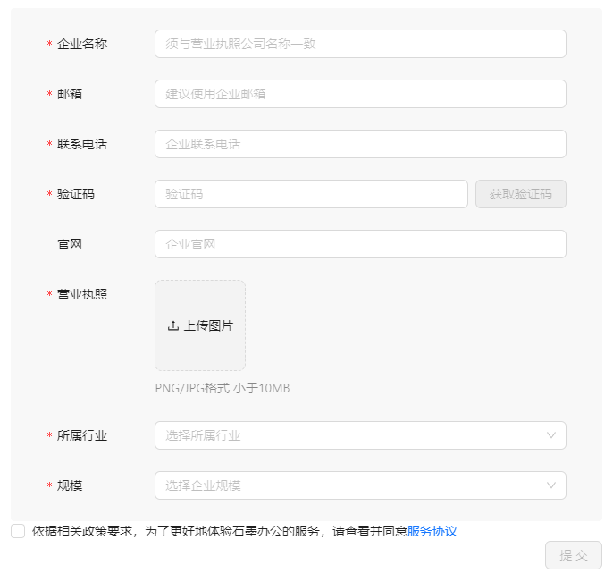
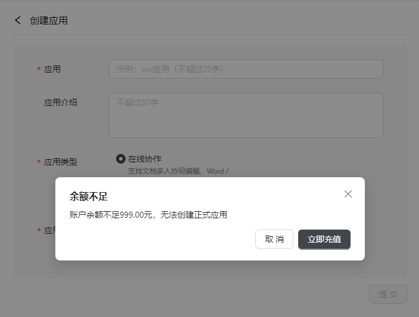

接入流程向您清晰的展示了接入石墨文档中台全过程，详细介绍了过程中的关键节点，按照该流程一步步操作下去您即可顺利创建自己的应用。

## 步骤1：企业认证

企业认证并通过审核后，即可创建应用并接入服务，否则您对控制台的使用权限将受限。

企业认证审核结果预计在您提交认证申请后 1 个工作日通过您预留的电子邮件告知，也可以通过【企业管理】查看审核结果。

:::info 提示

请如实填写您的认证材料，以便顺利通过审核。

:::

## 步骤2：创建测试应用

创建和使用测试应用无需付费，仅用于调试和体验。

当您创建应用时，应用环境选择为【测试环境】，创建的应用即为测试应用。

文档中台当前支持的应用类型为【在线协作】，每类应用只能创建 1 个测试应用。

:::caution 说明

- 可接入用户数 10 人；

- 测试应用创建 1 个月后下线，删除数据。

:::

## 步骤3： 企业账户充值

为企业账户充值后，充值金额将存储在您的企业账户余额中。

企业账户余额用于结算使用石墨文档中台服务产生的账单。如果企业账户产生欠费（即余额为负值），您企业名下的所有正式应用将被停止服务，请随时关注账户余额。

## 步骤4： 创建正式应用

企业账户余额大于 999 元，才能创建正式应用。

当您创建应用时，应用环境选择为【正式环境】，创建的应用即为正式应用。

正式应用面向真实用户，需经过官方审核后服务方可上线。石墨将在您提交应用审核后 1 日内通过预留的邮箱向您通知审核结果。

正式应用通过审核后服务即上线，并开始计费。开放服务平台每月对企业名下的正式应用生成账单并从账户余额中扣费。

## 步骤5：发票申请

每一次充值将产生订单，可以为您的订单申请发票。

该功能正在开发中，即将上线，敬请期待。

该功能上线前您所支付的订单，仍然可以在功能上线后申请发票，您不必为此担心。

