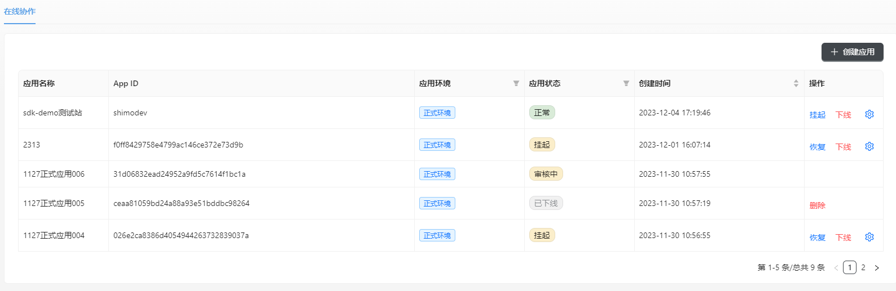
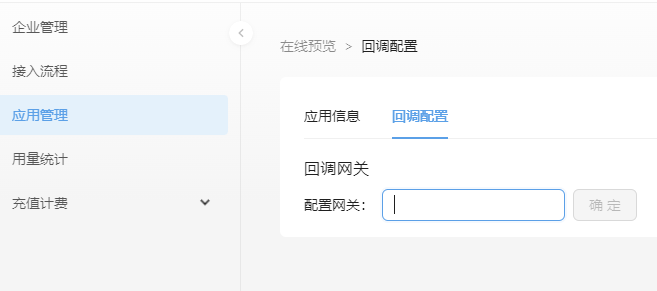

## 应用列表

通过应用列表，管理所有的正式应用和测试应用。列表项支持筛选和排序

您还可以对应用进行相关操作，以管理应用的状态。

## 应用信息

展示了每个应用的基本信息，应用的App ID 和 App Secret，用于您的应用接入开放服务平台的服务。

首次使用时，请重置 App Secret 以获得其值，并妥善保管。

## [回调配置](./../04service-callback/callback-gateway.md)

在您的回调服务开发到一定程度后，即可以将其部署至公网，并配置回调网关。

