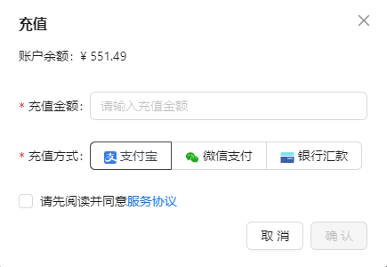
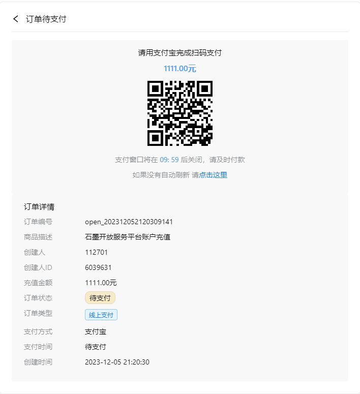
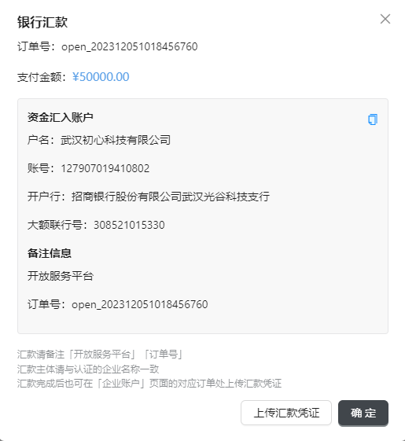
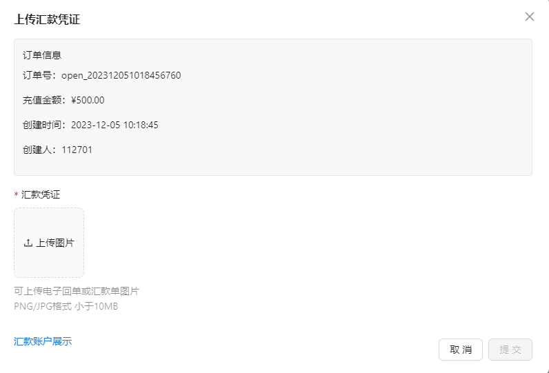
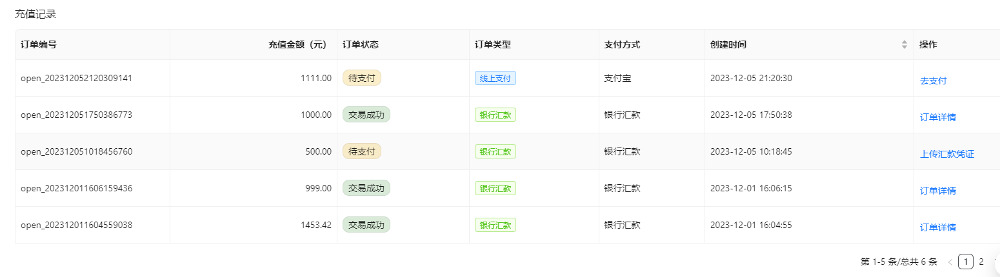
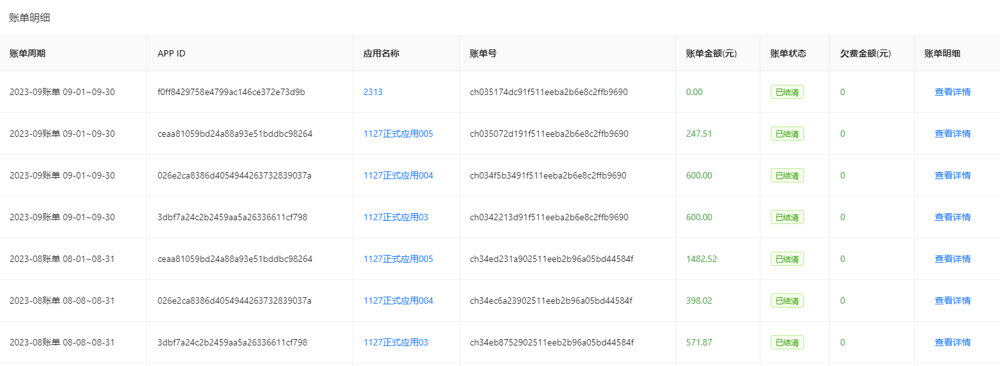

## 企业账户

### 账户余额及状态

* 账户余额情况关联到对应的账户状态，请确保您的账户有足够余额，以免影响正常使用。
* 如您采用银行汇款的方式为账户充值，由于该操作会产生一定的延迟，因此请及时处理汇款并上传汇款凭证，以便及时为您更新账户余额
* 每月 1 日，将为您的正式应用生成账单并从账户余额中扣费：
    * 如账户余额<0元，且处于该状态时长≤5日，账户状态将变为【欠费：缓冲期】，所有正式应用正常服务，请您及时为账户充值以免服务中止。
    * 如账户余额<0元，且处于该状态时长＞5日，≤30日，账户状态将变为【欠费：已停服】，所有正式应用访问服务中止，存储服务继续运行并计费，请您及时为账户充值以恢复服务。
    * 如账户余额<0元，且处于该状态时长＞30日，账户状态将变为【欠费：已下线】，所有正式应用将被下线、删除数据，且不可恢复。

### 账户充值

支持微信支付、支付宝支付和银行汇款三种充值方式。

- 选择微信或支付宝支付时，请在30分钟内完成支付，否则交易将关闭。

  

- 银行汇款支付，汇款时请正确填写账户信息和备注信息。汇款完成后请及时上传汇款凭证，汇款凭证上传后 3 个工作日内我们会完成汇款凭据的审核并通过您预留的邮箱向您通知汇款到账情况。

  :::caution 说明

  当已处于欠费状态，为了避免欠费时间过长导致服务停止，请尽早处理汇款。

  :::

​       

### 充值记录

查看充值记录，包括充值金额、订单状态及订单类型等信息。对于已支付的订单，单击操作栏的【订单详情】，则可以查看订单详细信息。

## 计费账单

用于查看和管理您的账单。

开放服务平台以自然月为周期，于每月 1 日为企业名下的每个正式应用生成上月的账单，并依据账单金额从账户余额中执行扣费，完成每月费用结算。

单击【应用名称】查看应用的用量情况，继续单击【查看详情】则可以查看账单明细。

