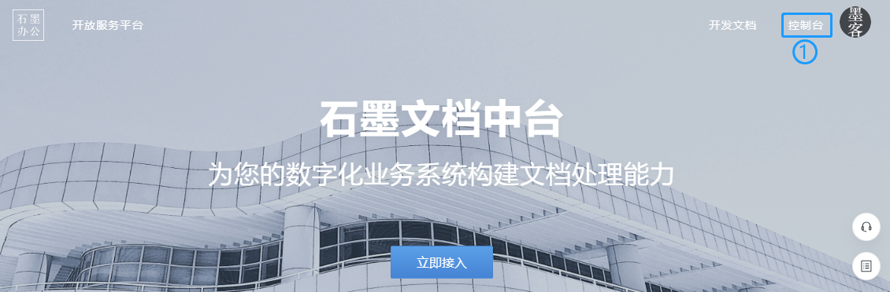
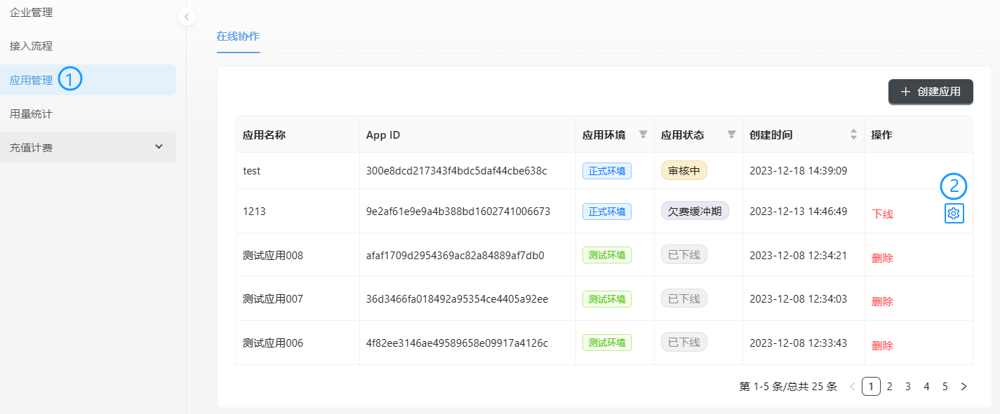
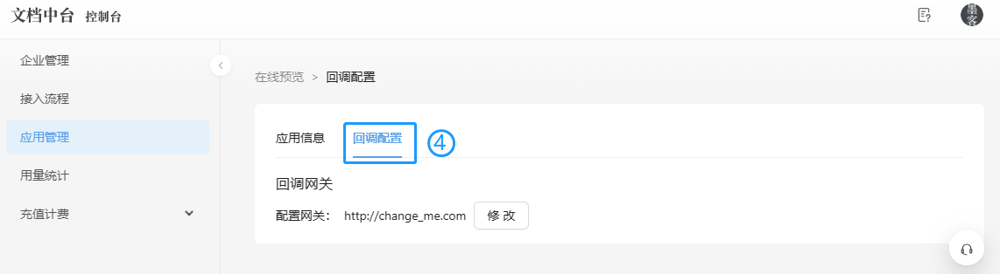

回调网关是石墨文档中台与接入方进行数据交互的总入口。调用行为发生在服务端之间，调用方式为HTTP请求。

接入方需使用能在公网被访问的回调接口，否则石墨文档中台无法与其进行数据交互。

回调网关设置好后，接入方需配置一些回调接口。回调接口会在用户使用文档中台功能（预览或编辑在线文档）时被调用，石墨文档中台则通过相关回调接口获取文件、用户等信息。

回调网关支持 http 和 https 协议，示例如下:

http://your_domain.com/api

http://108.11.22.33:80/api

https://108.11.22.33:80/api

https://your_domain.com/callback/api

## 配置步骤

**步骤1：**进入石墨开发服务平台，单击右上角【控制台】按钮，进入文档中台控制台页面。



**步骤2：**单击左侧导航栏的【应用管理】，选择状态正常的应用，在操作栏单击按钮。选择【回调配置】页签，设置回调网关。






**步骤3：**验证回调网关地址。

GET请求：

https://sdk-demo.shimorelease.com/sdk/v2/api/license/apps/{appId}

```
curl "https://office.shimoapi.com/sdk/v2/api/license/apps/yourShimoAppId?appId=yourShimoAppId&signature=yourSignatureString&token=yourTokenString"
```

| 传参方式 | 参数名    | 类型   | 值示例                               | 必选 | 说明                                                         |
| -------- | --------- | ------ | ------------------------------------ | ---- | ------------------------------------------------------------ |
| Path     | appId     | string | ebc1cde3-9b57-4962-883d-54302d428600 | 是   | 接入方从石墨获取的 AppId                                     |
| Query    | appId     | string | ebc1cde3-9b57-4962-883d-54302d428600 | 是   | 接入方从石墨获取的 AppId                                     |
| Query    | token     | string | eyJ0eXAiOiJKV1QiLCJhbGciOiJIUzI1NiJ9 | 是   | 接入方提供的 token ，在石墨请求接入服务商的接口时，会放到 HTTP Headers X-Shimo-Token 中作为值进行传递 |
| Query    | signature | string | 参考签名方法一节                     | 是   | 接入方，使用从石墨获取的 AppId 、AppSecret 根据签名方法生成的字符串 |

示例返回值：

```json
{
  "appName": "your app name",
  "availableFileTypes": [
    "document",
    "documentPro",
    "spreadsheet",
    "presentation",
    "table"
  ],
  "activatedUserCount": 43,
  "userCount": 50,
  "memberLimit": 99,
  "validFrom": "2020-12-31T16:00:00Z",
  "validUntil": "2022-12-30T16:00:00Z",
  "endpointUrl": "http://your-callback.com"
}
```
