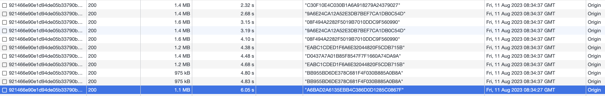
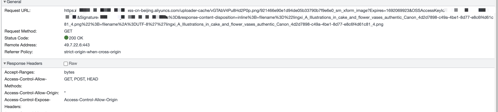
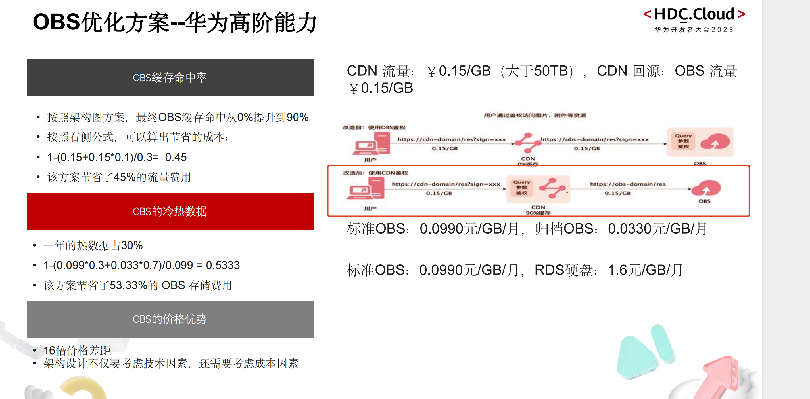

## 背景

有些公司会使用云服务的对象存储裁剪图片功能。而我们访问图片是有鉴权的，这样就会导致每次访问图片 url 都会变化，造成了无法使用上一次裁剪图片的缓存数据。

## 三种访问图片方式

- 1 OSS 鉴权 => OSS 图片
- 2 访问 CDN => OSS 鉴权 => OSS 图片
- 3 CDN 鉴权 => CDN 缓存 => OSS 图片
  

我们要使用第三种方案，也就是图里红框内的方案

该方案，既可以节省成本，还可以使用 CDN 缓存能力，提升访问速度

## 注意

如果该用户没有裁剪图片这种消耗性能的操作，我们可以直接使用 oss 的鉴权方案，该方案可以降低我们的一些架构复杂度成本。

## 参考

[CDN 加速 OSS 资源](https://help.aliyun.com/zh/cdn/use-cases/accelerate-the-retrieval-of-resources-from-an-oss-bucket-in-the-alibaba-cloud-cdn-console?spm=5176.8465980.top-nav.11.4e7014504Q0rtz&scm=20140722.S_help%40%40%E6%96%87%E6%A1%A3%40%40123226.S_BB1%40bl%2BBB2%40bl%2BRQW%40ag0%2Bhot%2Bos0.ID_123226-RL_cdn-LOC_console~UND~help-OR_ser-V_3-P0_2)

[配置 URL 鉴权](https://help.aliyun.com/zh/cdn/user-guide/configure-url-signing?spm=a2c4g.11186623.0.0.74f85c0a0p0SQg#task-2106935) （鉴权类型选择 A 类）
