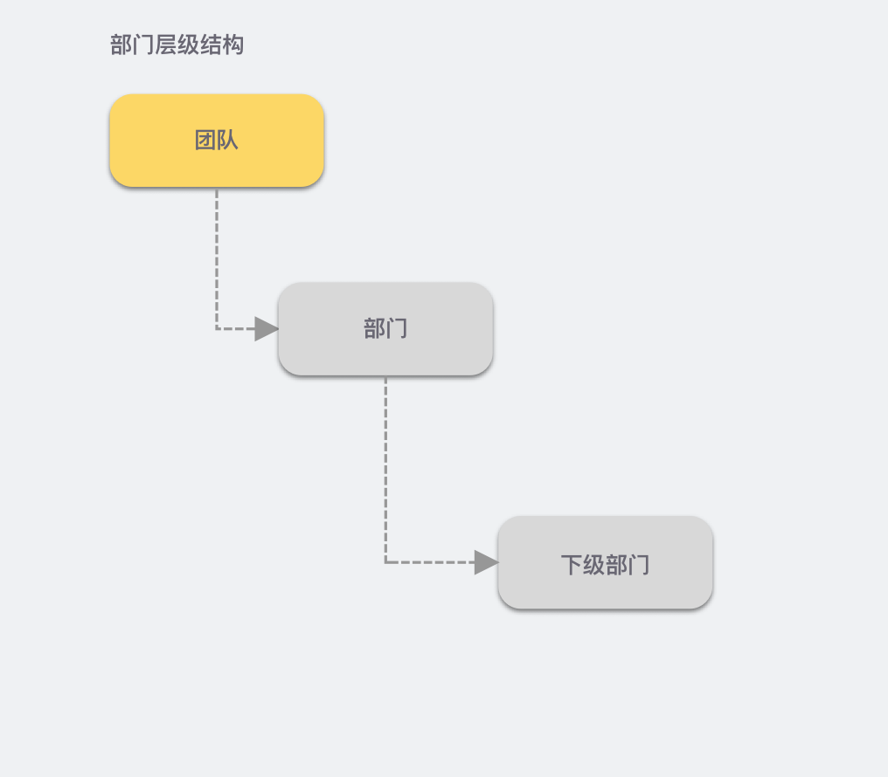

# Teams & Departments

## background

At present, the Graphite SDK has supported the collaboration function to obtain the relevant information such as files, permissions, and users of the access party, so that customers can manage files, users, permissions and other information in their own systems, and the graphite editor can be embedded in the business system of the access party after the user system is connected to the Graphite SDK.

In order to further improve the collaboration efficiency of large teams, we `2022.6.1` have introduced the concept of teams and departments in the release, which can be used in the following scenarios:

- **`提及（at）用户`** , you can search for users from the organizational structure level, so that you can query specified users from a clear hierarchy
- **`表格锁定`** When you add lock permissions, you can set permissions for departments instead of individual users to improve management efficiency
- After a user is mentioned, the User Information Card displayed when hover is on the mentioned user name **** supports displaying department information to make it easy to distinguish different users

## conception

### term

- **`团队`**
  - Also known as: `企业`
  - It is commonly used in the Graphite SDK `Team` to describe
  - `teamGuid` and  , `teamInfo.id`both represent the ID of the team
    - In `file` or `user` information, it's often used `teamGuid` to describe the team's ID
    - When getting `team` information, it's often used `teamInfo.id` to describe the ID of the team
- **`团队成员`**
  - It is commonly used in the Graphite SDK `TeamMember` to describe
- **`部门`**
  - It is commonly used in the Graphite SDK `Department` to describe
- **`部门成员`**
  - It is commonly used in the Graphite SDK `DepartmentMember` to describe

### Relationships between entities

Typically, there is only one team in an accessing system, and different teams are made up of departments, which can have a multi-level structure to meet the inclusion relationship between departments.

:::caution 注意

If you do have multiple teams, please **** communicate with Graphite before joining whether the specific needs meet the requirements. 

:::

#### `团队` Relationship with `团队成员` and  usage scenarios

There are multiple team members under a team, and there is no hierarchy with this relationship.

```json title="团队与成员关系结构"
team
├── member1
├── member2
├── member3
├── member4
└── member5
```

##### Usage scenarios

In the Graphite SDK, `提及用户`you can find the user you want to mention through your address book, and one of the ways is to search from the team member list, which will get the team list by paginating the list. 

#### `团队` Relationship with `部门` and  usage scenarios

The team always exists as the root node of the department. It looks like this:

```json title="团队与部门示例"
team1
└── department1
    ├── department2
    │   └── department3
    └── department4
        └── department5
```

##### Usage scenarios

- `提及用户`, it will first start searching for sub-departments through the root node (team level), expand the departments to get the sub-departments, and then search down as needed
- `表格锁定`to find child departments based on the root node to set lock permissions for departments

#### `部门` Relationship with `部门成员` and  usage scenarios

Currently, in addition to the root node (team level), the following department levels can contain multiple members.

:::tip tip

`部门成员` It can belong to multiple `部门`or only one `部门` , depending on the implementation of the access system, the Graphite SDK is not limited, but it is more common for a member to belong to only one department. 

Due to differences in understanding, the final result may be different:

- Members belong to **multiple departments**:`张三` belong to `研发部 - 后端组` , and Zhang San is included in both `后端组` the  department and the `研发部` department. 
- The members belong to **a department**:`张三` belong to `研发部 - 后端组` , and Zhang San's direct department is `后端组` ,  not directly under `研发部` . 

Due to the different implementations, the **`部门成员总数`** way of statistics is also different in actual use  . 

:::

```json title="部门与部门成员示例"
team1
└── dept1
    ├── dept2
    │   ├── member3
    │   └── member4
    ├── member1
    └── member2
```

##### Usage scenarios

- `提及用户`, first search for child departments through the root node (team level), expand the department to get the members under the department, and then search down as needed

### Department hierarchy diagram {#department-structure}

In the Graphite SDK, the team (or the enterprise) is a special department, which defaults to the top-level node (or root node) in the department, and the team is in the system of the access party, the team



### Description of the department node type {#department-node-types}


## implement

Once you've learned the above concepts, you can start onboarding to team- and department-related features.

### The access party implements the interface

The functions related to the access team and the department mainly involve the development of callback interfaces implemented by the access party, including several `接口变更` and `接口新增`:

#### API changes

- [Get the current user information](../impl.md#user-current)

```diff title="Response Body Example"
{
  "id": "userid123",
  "name": "张三",
  "avatar": "http://fake.site/user-123.png",
  "email": "user123@fake.site",
  // highlight-next-line
+ "teamGuid": "123"  // 接入方用户当前所属的团队 ID
}
```

- [Get Meta Information - Collaborate Documents](../impl.md#file-meta-collab)

```diff title="Response Body Example"
{
  "id": "ba13551165cc5066",
  "name": "示例文档",
  "type": "document",
  "permissions": {
    "commentable": true,
    "editable": true,
    "readable": true,
    "exportable": true
  },
  "views": 100,
  "creatorId": "1",
  "createdAt": "2021-08-01T00:00:00Z", // UTC 时间，0 时区，在北京时间基础上减 8 小时
  "updatedAt": "2021-08-02T00:00:00Z", // UTC 时间，0 时区，在北京时间基础上减 8 小时
  // highlight-next-line
+ "teamGuid": "123" // 接入方文件所属团队 ID
}
```

- [Search for files, users, team members, and departments based on keywords](../impl.md#search-by-keyword)

```diff title="Request Body Example"
{
  "fileId": "file1234",
  "keyword": "test",
  "page": 0,
  "pageSize": 6,
  // highlight-start
- "type": "file_name,recent_contact,collaborator"
+ "type": "file_name,recent_contact,collaborator,team_member,department"
  // highlight-end
}
```

```diff title="Response Body Example"
{
  "files": { // 按文件名搜索的文件
    "count": 3,
    "page": 0,
    "pageSize": 6,
    "pageCount": 3,
    "results": [
      ...
    ]
  },
  "recentUsers": { // 最近联系人等
    "count": 2,
    "page": 0,
    "pageSize": 6,
    "pageCount": 2,
    "results": [
      ...
    ]
  },
  "collaborators": { // 协作者
    "count": 2,
    "page": 0,
    "pageSize": 6,
    "pageCount": 1,
    "results": [
      ...
    ]
  },
+ "teamMembers": { // 团队成员
+   "count": 2,
+   "page": 0,
+   "pageSize": 6,
+   "pageCount": 1,
+   "results": [
+     {
+       "id": "userid123",
+       "name": "张三",
+       "avatar": "http://fake.site/user-123.png",
+       "email": "user123@fake.site"
+     },
+     {
+       "id": "userid456",
+       "name": "李四",
+       "avatar": "http://fake.site/user-123.png",
+       "email": "userid456@fake.site"
+     }
+   ]
+ },
+ "department": {
+   "count": 2,
+   "page": 0,
+   "pageSize": 6,
+   "pageCount": 1,
+   "results": [
+     {
+       "id": "2",
+       "name": "后端组",
+       "allMemberCount": 9,
+       "parentDepartments": [
+         {
+           "id": "3",
+           "name": "XXX 事业部" // 一级部门
+         },
+         {
+           "id": "4",
+           "name": "YYY 产品部"
+         }
+       ]
+     },
+     {
+       "id": "userid456",
+       "name": "基础服务后端组", // 已经是一级部门
+       "allMemberCount": 20,
+       "parentDepartments": []
+     }
+   ]
+ }
}
```

#### The API is added

- [Get information about the team the current user belongs to](../impl.md#user-current-team)
- [Obtain the user's department path](../impl.md#user-department-paths)
- [Get a list of members under the team](../impl.md#team-members)
- [Get departmental information](../impl.md#department-info)
- [Gets the sub-department nodes of the department](../impl.md#children-departments)
- [Get a paginated list of members under the department](../impl.md#department-members)

### ❗ Description of the special department ID {#depatment-id-tips}

In the Graphite SDK, the default `根节点部门` corresponds to `团队` the information, so it is fetched

- `部门信息`
- `部门的下级部门`
- `部门下的成员列表`

, use the following rule to represent the department ID of the root node:

`TEAM_{团队 ID}`

As:

If  the Team ID obtained `获取当前用户所在团队信息`from  is , `123`the URL requested to obtain the department information is in the form of:

- GET `/departments/TEAM_123`
  - Get team level department information to return to the [department structure](../impl.md#department-info) 
- GET `/departments/TEAM_123/children`
  - Get sub-departments of team level departments, first-level departments, return [to the list of departments](../impl.md#children-departments)
- GET `/departments/TEAM_123/members?page=1&pageSize=20`
  - Obtain the list of members under the team level department, and return it as a list of team members and users in the [ form of ](../impl.md#department-members)a list of department members

### ❗ `表格锁定` in Settings `全员锁定` Setup Instructions

In the Graphite SDK table editor, if you add  and select `表格锁定` to set lock permissions, the callback interface must meet the following conditions`企业全员`: 

1. `currentUser.teamGuid` Not empty
1. `file.teamGuid` Not empty
1. `currentUser.teamGuid`If it is equal  to  , `file.teamGuid` the current user will be judged to be within the scope of full lockout

### ❗ `表格锁定` Limitation Description

After using the function of connecting teams and departments, the table editor will check `当前用户`  whether `当前文件` and are `teamGuid` equal, if they are not equal, the table cannot be locked. 
