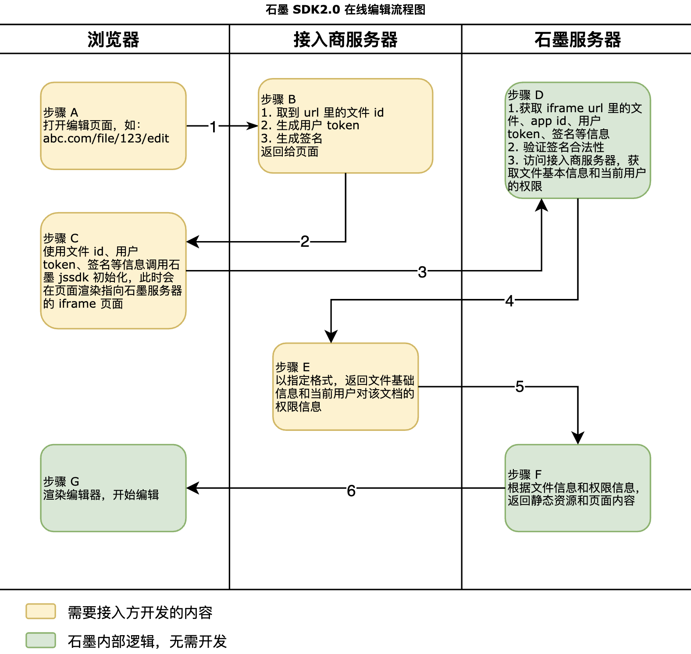

# 基础概念

目前支持以网页的形式接入以下功能：

#### 一、协同文档

协同文档是指可供多人实时协作的在线文档/表格/幻灯片。

支持直接创建**石墨格式的文档**来进行查看/编辑。也支持将本地文件通过 API 接口（参考 [导入接口](../apis/file.md#导入文件) ）转换成协同文档来查看/编辑。

要实现协同文档的预览，将用户对文档的权限设置为只读即可，参考 [获取文件元信息](./impl.md#file-meta-collab) 一节里的`permissions`部分。

存储格式为石墨特有格式，不是 Office 文件；文件将存储在石墨服务器上；

要将在线文档转换成 Office 文件，请参考 [导出接口](./apis/edit.md#导出文件) 。

#### 二、文件预览

文件预览是将接入方的文件转换成 Web 支持的格式来进行预览和查看。

此种模式下**不能编辑**，如果有编辑需要，请参考 [上一节](#一协同文档)。

## 基本流程

## 接入须知

若要接入石墨 SDK，需要了解以下概念，同时需要接入方前后端开发的支持。

### 获取 `appId` 和 `secret`

- `appId` 用于供石墨服务器识别来自哪个服务商，不同 `appId` 对应的数据无法互通。格式类似 `400bdc777f31d6e63ae8eb5dcb4c0e63`。
- `secret` 用于给请求签名，石墨服务器会通过签名验证请求的合法性。所有调用石墨服务器的接口都需要携带签名信息，签名信息通过 `secret` 和规定格式的 `payload` 生成，点击 [查看具体逻辑和代码示例](./resources.md#signature)。

`appId` 和 `secret` 由石墨系统颁发。请联系石墨获取相应的 `appId` 和 `secret` 使用。

调用石墨服务器接口时，需要同时携带 `appId` 和签名信息。石墨服务器收到请求后，会先识别接入方身份，然后验证签名是否合法，最后再进行后续的 [回调接口](./impl.md) 等动作。

### 开发 Web 页面

提供容器（HTMLElement）用于承载石墨编辑器（图中步骤 A）。

### 生成用户 token

在图中第 4 步，石墨服务器收到请求后需要向接入方服务器请求当前文件的基本信息，所以需要接入方生成一个用户 token，供接入方服务器处理石墨服务器请求的时候识别用户。此 token 石墨服务器仅做传递使用。

访问接入方服务器时，会将用户 token 以 HTTP Header `X-Shimo-Token` 的形式传递过去。

用户 token 的格式不做限制，甚至可以在早期测试阶段直接使用用户 id，石墨不关心格式，token 也不做他用。接入方需要根据自己的安全策略制定生成 token 的方式。

### 使用石墨 JSSDK

JSSDK 的作用是生成一个指向石墨服务器的编辑器地址，然后以 iframe 的形式加载到当前页面中。同时封装了 iframe 页面通信方法，用于一些基本的操作。具体见 [石墨 JSSDK](./resources.md#js-sdk)。

### 开发回调接口

在图中第 4 步，接入方需要提供若干接口供石墨调用。最核心的接口是提供文件基本信息和当前用户对文件的权限信息。这些接口需能被石墨服务器访问到，也只会被石墨服务器访问。接入方可能需要配置防火墙或者 IP 白名单。接口的访问前缀在获取 `appId` 和 `secret` 的时候提供，格式类似 abc.com/shimo。返回结果只支持 json 格式。需要实现的 API 列表见[接入方实现接口](./impl.md)。
