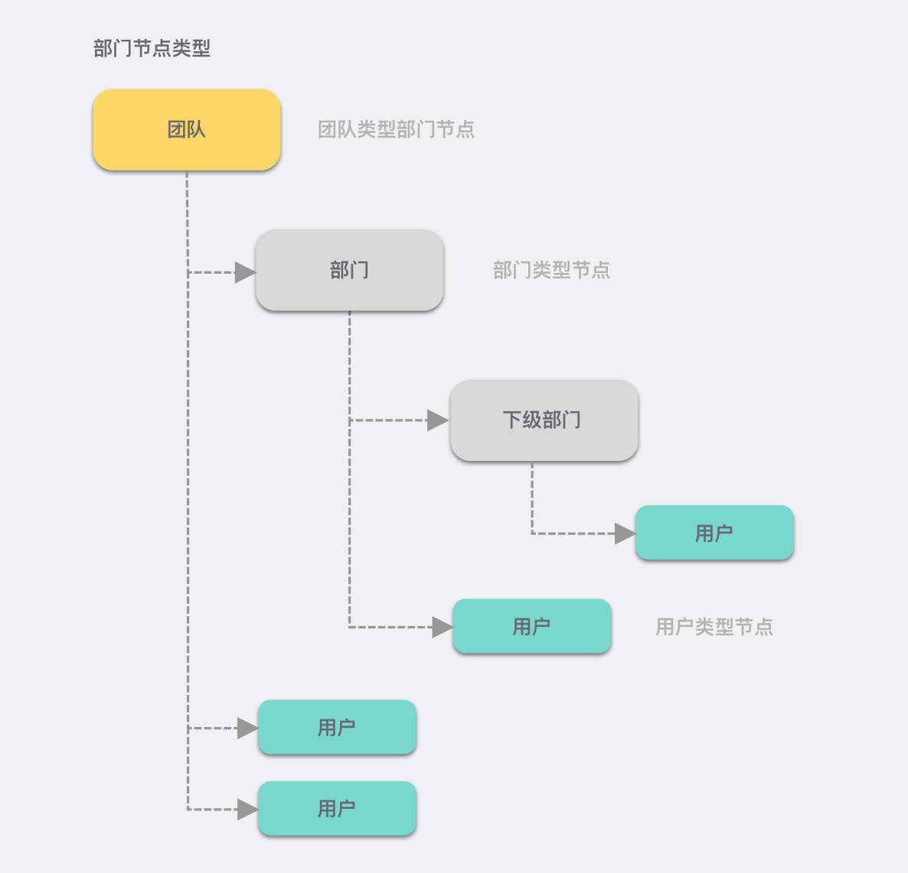

# 团队与部门

## 背景

目前石墨 SDK 已支持协同功能中获取接入方文件、权限、用户等相关信息，使得客户可在自身系统中实现文件、用户、权限等信息的管理，而将用户系统与石墨 SDK 对接后可以将石墨编辑器嵌入到接入方的业务系统中。

为了进一步提高大型团队的协作效率，在 `2022.6.1` 版本中我们引入了团队和部门的概念，可用于以下场景：

- **`提及（at）用户`** 时，支持从组织架构层面查找用户，方便从清晰的层级中查询指定的用户
- **`表格锁定`** 添加锁定权限时，支持设置部门的权限而不只是针对单个用户设置权限，以提高管理的效率
- 提及用户后，在 hover 到提及的用户名上时展示的 **用户信息卡片** 支持显示部门信息，方便区分不同用户

## 概念

### 术语

- **`团队`**
  - 也可称为 `企业`
  - 石墨 SDK 中通常使用 `Team` 来描述
  - `teamGuid` 与 `teamInfo.id`，两者皆表示团队的 ID
    - 在 `file` 或 `user` 信息中，通常使用 `teamGuid` 来描述团队的 ID
    - 在获取 `team` 信息时，通常使用 `teamInfo.id` 来描述团队的 ID
- **`团队成员`**
  - 石墨 SDK 中通常使用 `TeamMember` 来描述
- **`部门`**
  - 石墨 SDK 中通常使用 `Department` 来描述
- **`部门成员`**
  - 石墨 SDK 中通常使用 `DepartmentMember` 来描述

### 实体之间的关系

通常情况，一个接入方系统中仅对应一个团队，而不同的小组由部门构成，而部门可以有多级结构，以满足部门间的包含关系。

:::caution 注意

若确实有多个团队的组织形式，请在 **接入前** 与石墨沟通具体需求是否满足要求。

:::

#### `团队` 与 `团队成员` 的关系及使用场景

团队下包含多个团队成员，此关系并无层级结构问题。

```json title="团队与成员关系结构"
team
├── member1
├── member2
├── member3
├── member4
└── member5
```

##### 使用场景

在石墨 SDK 中，`提及用户`时，可通过通讯录查找想要提及的用户，而从团队全员列表中查找是其中一种方式，此方式会按照分页查询的方式获取团队全员列表。

#### `团队` 与 `部门` 的关系及使用场景

团队总是作为部门的根节点存在。如下所示：

```json title="团队与部门示例"
team1
└── department1
    ├── department2
    │   └── department3
    └── department4
        └── department5
```

##### 使用场景

- `提及用户`，首先会通过根节点（团队级别）开始搜索子级部门，展开部门后获取下级部门，然后按需向下查找
- `表格锁定`，根据根节点查找子级部门，以对部门进行锁定权限设置

#### `部门` 与 `部门成员` 的关系及使用场景

目前除根节点（团队层级）以外，以下的部门层级可包含多个成员。

:::tip 提示

`部门成员` 可以属于多个 `部门`，也可仅属于一个 `部门` ，取决于接入方系统的实现，石墨 SDK 暂无限制，但一个成员仅属于一个部门的用法较为常见。

由于理解上的不同可能最终实现结果不同：

- 成员属于 **多个部门**：`张三` 属于 `研发部 - 后端组` ，张三既包含在 `后端组` 部门中，也包含在 `研发部` 部门中。
- 成员属于 **一个部门**：`张三` 属于 `研发部 - 后端组` ，张三直属部门为 `后端组` ，而非直属 `研发部`。

由于实现不同，在实际使用中，统计 **`部门成员总数`** 的方式也不同。

:::

```json title="部门与部门成员示例"
team1
└── dept1
    ├── dept2
    │   ├── member3
    │   └── member4
    ├── member1
    └── member2
```

##### 使用场景

- `提及用户`，首先会通过根节点（团队级别）开始搜索子级部门，展开部门后获取部门下的成员，然后按需向下查找

### 部门层级结构图示 {#department-structure}

在石墨 SDK 中，团队（或认为是企业）是一个较为特殊的部门，默认作为部门中的顶级节点（或根节点）。


### 部门节点类型图示 {#department-node-types}



## 实现

了解完以上概念后，可以开始接入团队和部门相关的功能。

### 接入方实现接口

接入团队与部门相关功能，主要涉及接入方实现的回调接口的开发，包括若干 `接口变更` 和 `接口新增`：

#### 接口变更

- [获取当前用户信息](../impl.md#user-current)

```diff title="Response Body Example"
{
  "id": "userid123",
  "name": "张三",
  "avatar": "http://fake.site/user-123.png",
  "email": "user123@fake.site",
  // highlight-next-line
+ "teamGuid": "123"  // 接入方用户当前所属的团队 ID
}
```

- [获取元信息-协同文档](../impl.md#file-meta-collab)

```diff title="Response Body Example"
{
  "id": "ba13551165cc5066",
  "name": "示例文档",
  "type": "document",
  "permissions": {
    "commentable": true,
    "editable": true,
    "readable": true,
    "exportable": true
  },
  "views": 100,
  "creatorId": "1",
  "createdAt": "2021-08-01T00:00:00Z", // UTC 时间，0 时区，在北京时间基础上减 8 小时
  "updatedAt": "2021-08-02T00:00:00Z", // UTC 时间，0 时区，在北京时间基础上减 8 小时
  // highlight-next-line
+ "teamGuid": "123" // 接入方文件所属团队 ID
}
```

- [根据关键字搜索文件、用户、团队成员、部门](../impl.md#search-by-keyword)

```diff title="Request Body Example"
{
  "fileId": "file1234",
  "keyword": "test",
  "page": 0,
  "pageSize": 6,
  // highlight-start
- "type": "file_name,recent_contact,collaborator"
+ "type": "file_name,recent_contact,collaborator,team_member,department"
  // highlight-end
}
```

```diff title="Response Body Example"
{
  "files": { // 按文件名搜索的文件
    "count": 3,
    "page": 0,
    "pageSize": 6,
    "pageCount": 3,
    "results": [
      ...
    ]
  },
  "recentUsers": { // 最近联系人等
    "count": 2,
    "page": 0,
    "pageSize": 6,
    "pageCount": 2,
    "results": [
      ...
    ]
  },
  "collaborators": { // 协作者
    "count": 2,
    "page": 0,
    "pageSize": 6,
    "pageCount": 1,
    "results": [
      ...
    ]
  },
+ "teamMembers": { // 团队成员
+   "count": 2,
+   "page": 0,
+   "pageSize": 6,
+   "pageCount": 1,
+   "results": [
+     {
+       "id": "userid123",
+       "name": "张三",
+       "avatar": "http://fake.site/user-123.png",
+       "email": "user123@fake.site"
+     },
+     {
+       "id": "userid456",
+       "name": "李四",
+       "avatar": "http://fake.site/user-123.png",
+       "email": "userid456@fake.site"
+     }
+   ]
+ },
+ "department": {
+   "count": 2,
+   "page": 0,
+   "pageSize": 6,
+   "pageCount": 1,
+   "results": [
+     {
+       "id": "2",
+       "name": "后端组",
+       "allMemberCount": 9,
+       "parentDepartments": [
+         {
+           "id": "3",
+           "name": "XXX 事业部" // 一级部门
+         },
+         {
+           "id": "4",
+           "name": "YYY 产品部"
+         }
+       ]
+     },
+     {
+       "id": "userid456",
+       "name": "基础服务后端组", // 已经是一级部门
+       "allMemberCount": 20,
+       "parentDepartments": []
+     }
+   ]
+ }
}
```

#### 接口新增

- [获取当前用户所在团队信息](../impl.md#user-current-team)
- [获取用户部门路径](../impl.md#user-department-paths)
- [获取团队下的成员列表](../impl.md#team-members)
- [获取部门信息](../impl.md#department-info)
- [获取部门的下级部门节点](../impl.md#children-departments)
- [获取部门下的成员分页列表](../impl.md#department-members)

### ❗ 特殊部门 ID 说明 {#depatment-id-tips}

在石墨 SDK 中，默认 `根节点部门` 对应 `团队` 信息，因此在获取

- `部门信息`
- `部门的下级部门`
- `部门下的成员列表`

时，使用如下规则表示根节点的部门 ID：

`TEAM_{团队 ID}`

如：

从 `获取当前用户所在团队信息` 获取的 Team ID 为 `123`，则获取部门信息时请求的 URL 形式为：

- GET `/departments/TEAM_123`
  - 获取团队层级部门信息，以 [部门结构](../impl.md#department-info) 返回
- GET `/departments/TEAM_123/children`
  - 获取团队层级部门的下级部门，一级部门，返回 [部门列表](../impl.md#children-departments)
- GET `/departments/TEAM_123/members?page=1&pageSize=20`
  - 获取团队层级部门下的成员列表，以 团队成员用户列表按照 [部门成员列表](../impl.md#department-members) 形式返回

### ❗ `表格锁定` 中设置 `全员锁定` 设置说明

石墨 SDK 表格编辑器中，若添加 `表格锁定` 时，选择对 `企业全员` 设置锁定权限时，回调接口需要满足以下条件：

1. `currentUser.teamGuid` 不为空
1. `file.teamGuid` 不为空
1. `currentUser.teamGuid` 与 `file.teamGuid` 相等时，当前用户才会被判定属于全员锁定的范围内

### ❗ `表格锁定` 限制说明

在使用接入团队、部门功能后，由于表格编辑器会检查 `当前用户` 及 `当前文件` 的 `teamGuid` 是否相等，若不相等，则无法进行表格锁定操作。
